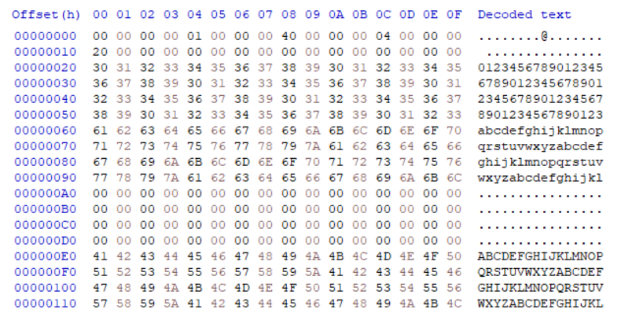

# Assignment 1

## Basic Idea

At the beginning of the file, we allocated a 32-byte space to store essential information of the page file:

```text
+-------------+-----------+----------+--------+----------+
| version     | page_size | page_num | offset | reserved |
+-------------+-----------+----------+--------+----------+
| 4 + 4 bytes | 4 bytes   | 4 bytes  | 4 bytes| 12 bytes |
+-------------+-----------+----------+--------+----------+
```

`page_num` for the total count of pages, as it's demanded in the specification of assignment 1. The other items

- `version`: page file layout version
- `page_size`: page size
- `offset`: the offset of the starting byte of the first page
- `reserved`

are reserved for future use.

Every time we close a page file, the head will be updated while every time we open such a file, the head is read and the file handler will be updated.

the start byte of the $i$-th page is calculated by `HEAD_SIZE` (which equals to `offset`, but we temporarily used macro) plus $i$ times `PAGE_SIZE` (`page_size`). And we used `fseek`, `fread`, `fwrite` to locate the file pointer, read file content to buffer, and write out buffer to file, we check the return value of every call of such method to detect possible errors.

## Results

The executable passed all the tests provided in `test_assign1_1.c` and a customized multiple pages case `testMultiplePageContent`.


The written out binary file `test_pagefile.bin` has the following structure after calling `testMultiplePageContent` before destoryed.



No memory leaks are detected. (Here for convenience, we adopted Visual Studio's remote debugging tool and turned on heap snapshots)


